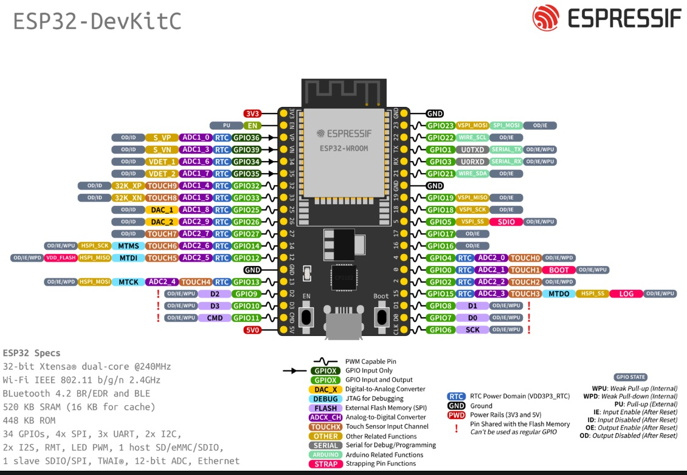
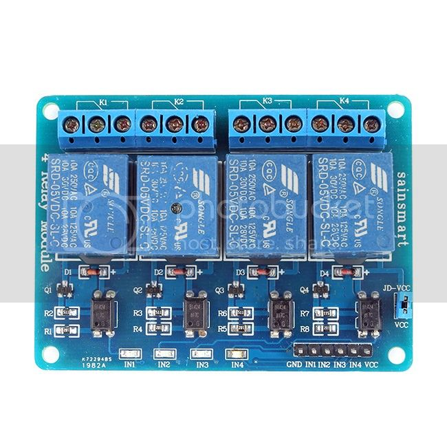

# autopilot box parts

To build autopilot diy. This list of parts is a minimum to build `box` with parts to communicate with system processing compass reading and actuator / motor.

This setup allows you to:

- `drive electric motor` by reversing polarity to get directions

- `use cloth` - to engage or disengage hydraulics or bigger actuators 

#### bom

- 1x dc to dc power supply (cv cc)
    any step down converter able to make 1A will do
    `XL4015` | `lm2596` | 

- 1x esp32 wroom 32e

- 1x 4ch relay module (*look below for reference*)
  OR

- 1x H bridge `BTS7960`
  OR

- 1x servo motor with pwm like servo from rc

- 1x actuator or motor to spin steering wheal

##### addons

- buttons
  it's possible to add buttons as switches or momentary buttons and bind them to some actions
- screens
  you can use any screen in system to show / give some additional actions. Look for **site / autopilot_v3_svg** as a example Graphical Interface
- position rudder sensor
  can be added by adding rotary resistor ~5KOhm or encoder, magnetic encoder, .....

###### esp32 wroom 32e pinout

###### 4ch relay module

