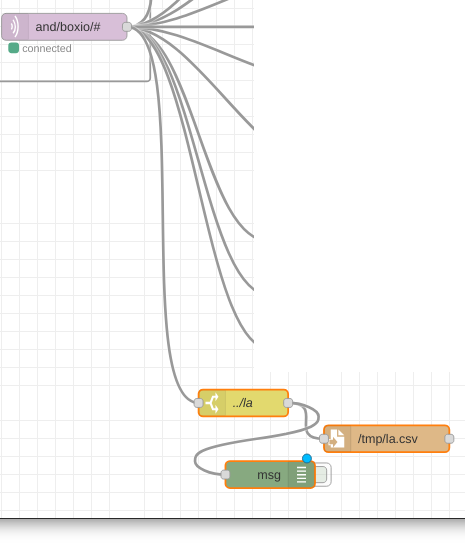
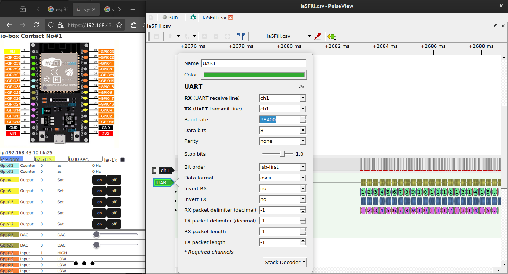

# io-box-logic-analizer

## node-red capture data

Save data to file flow [json](./assets/iobox_logicAnalizer_nodeRed_saveToFile_flow.json)

## convert data

Data is capture with time stamp. So we need to resample it.
Use script `./assets/csvToSigrok2py`
Need to set up in code resampling bitrate.

## process data

By using **Pulseview** we can load *.csv file from data captured.
Configuration `t,l`

## screenshot

