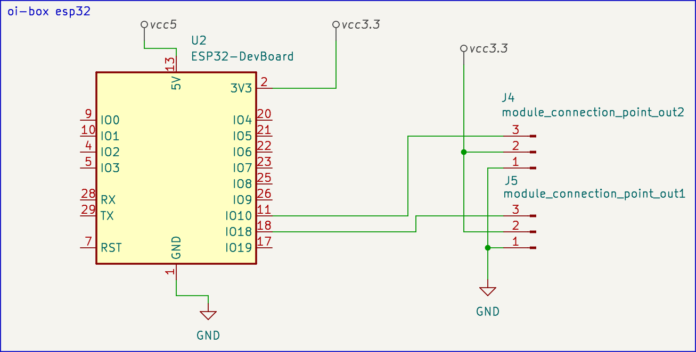
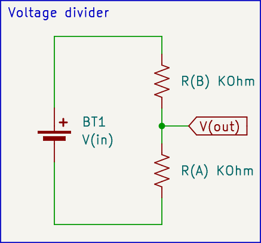

# io-box-modules

Concept of universal modules, multipurpuse pre build by you components to do thinks. As open project those are some examples shematics. It's to manage wire's, power bus bars make trouble shooting more easy.

## connection points and wires

io-box as name implise is a `box`. It need to have main parts / components hide from element. Contain all parts it some semi confind space. It can be a squear cutting boar with all component attatch to it. We want to have no moveng parts so no stress on wires or connectors. No humidyti, no water.

io-box is build on esp32 dev boars. It's comming with some pins duing functions for us. We want to get GND, 3.3V or 5V and our GPIO of intrerent. This is creating our point to connect `io-box-module`.


#### esp32 and connector for modules



module_connection_point_out1, module_connection_point_out2 on example are two module connection point's to use with modules.


## multimiter for 12v aks voltage divider

GPIO on esp able to read voltage state on pin is colled ADC analog to digital converner. It can handle voltage range from 0 ... 1.2v (in this example) So if we want to mesure 12v battery it's 10x more then max of GPIO can handle. We need to divide it! 
Solution:
- resistor value of A KOhm
- resistor value of B KOhm



Using function
```
V(in)  *  R(B)  /  (  R(B)  +  R(A) )  = V(out)
```
* V(in) - ( + of 12V battery)
* V(out) - voltage after divider

We can calculating out output voltage after divider. We want some margines of error. In example of 12V battery it's possible that it will get to 14.7V in process of charging so **DON'T PASS 1.2V** after divider.


Example schematic with values of resistors.


Want different walue 
[online calculator](https://ohmslawcalculator.com/voltage-divider-calculator)


## termoresistor termometer sensor


Calculation of ?R walue can be done using  
[online calculator](https://ohmslawcalculator.com/voltage-divider-calculator)

