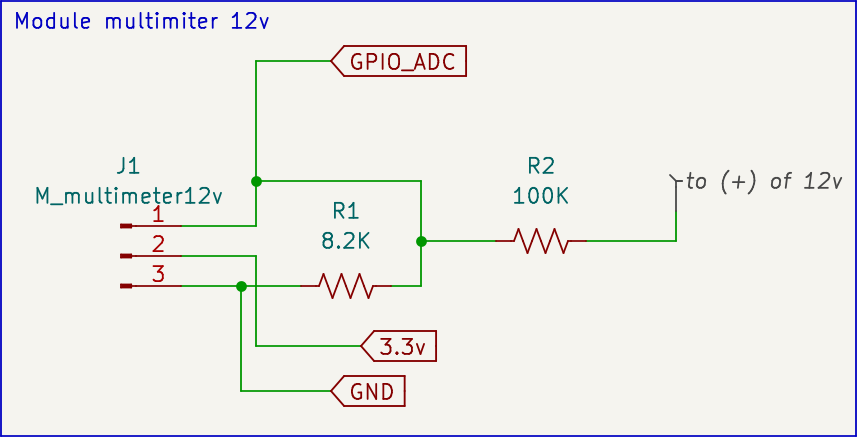
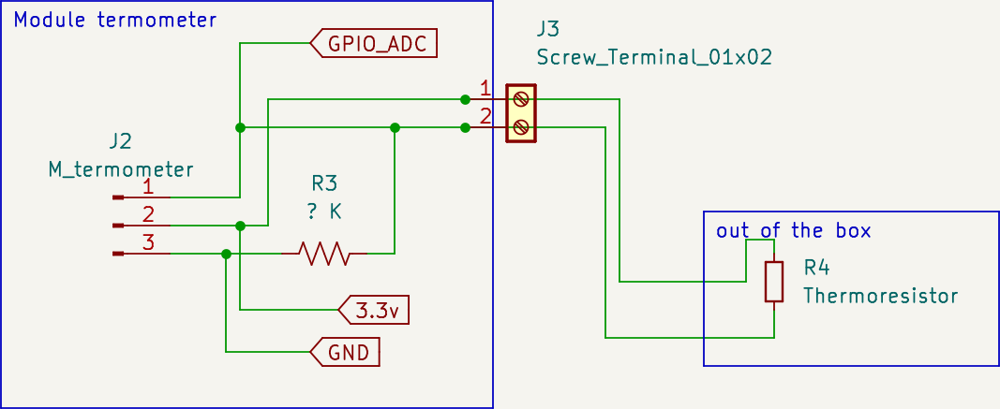

# io-box-modules

Concept of universal modules, multipurpuse pre build by you components to do thinks. As open project those are some examples shematics.

## multimiter for 12v

Want different walue 
[online calculator](https://ohmslawcalculator.com/voltage-divider-calculator)

## termoresistor termometer sensor

Calculation of ?R walue can be done using  
[online calculator](https://ohmslawcalculator.com/voltage-divider-calculator)