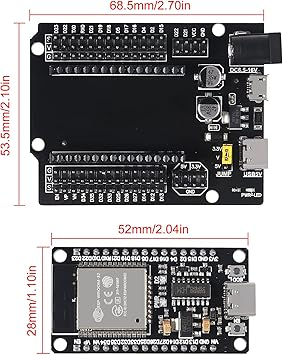

# # io box parts

To build universal **io-box**. This list is a list of parts assuming that your box is base on **esp32 wroom 32e**.

#### bom

- 1x **power_supply**
- 1x esp32 wroom 32e on devkit board
- 1x box of  dupon wires if you don't solder
- wires to connect sensors and box ( cat 6 Ethernet cable )

##### addons

- connection bus for connecting internal wires with external wires

- switch to to turn on / off your project

- fuse to secure your project from over powering something

- box to close your project

- sheald to easy connect ping and have multiple +VCC and GND to wark with.
  
    

- dupon wires 
  
  
