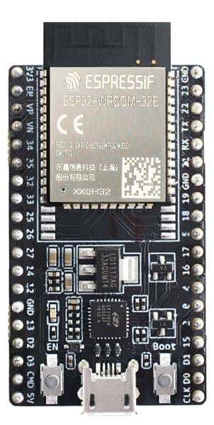
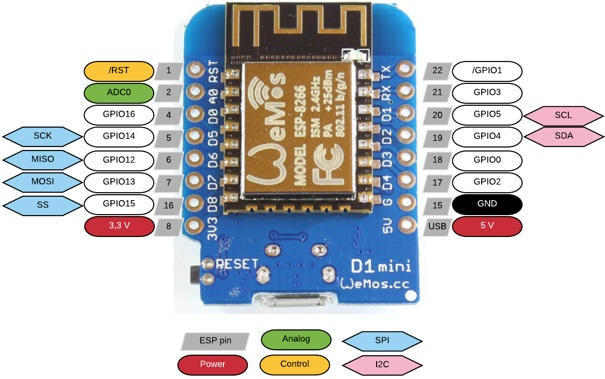
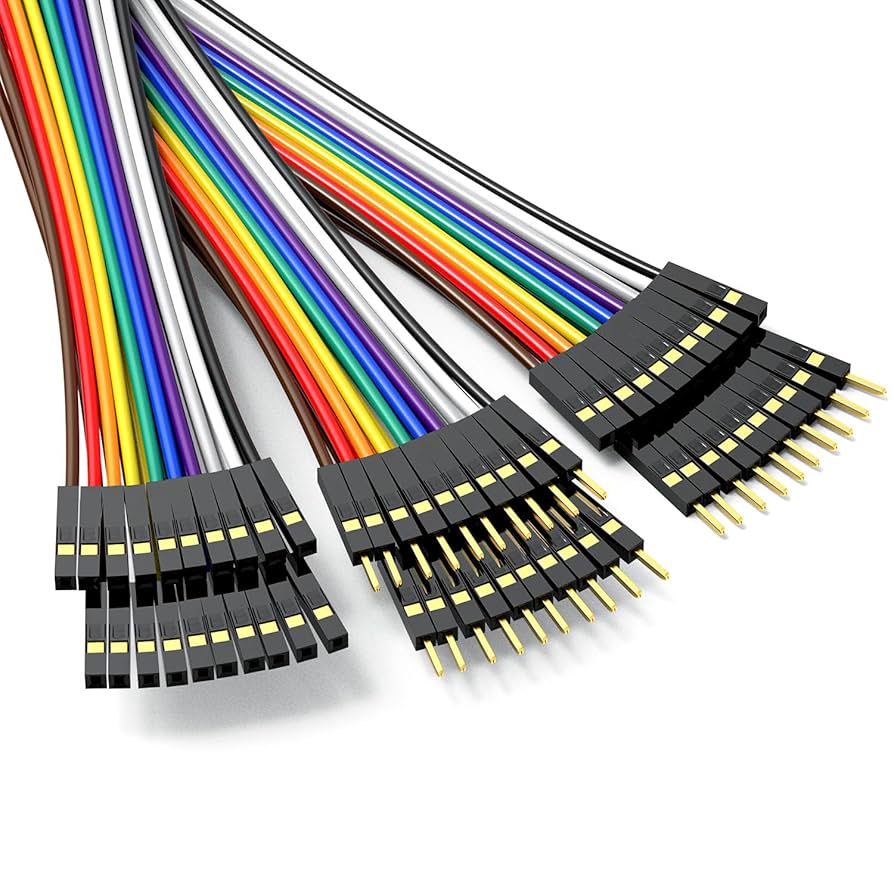

# io box

Universal box with ports / pins. It can be used in many use examples.

## for what it's

In many projects you need to use a sensor / button / ..  or make something in real world, turn on light or make sound, open gate. Your project is in digital world. But to connect numbers or states in your project, you need a bridge to phis cal world. **io-box** have many pin's. **esp32** can make them do amazing things. But to simplify it we will go over 4 ways of using pins:

#### inputs

So events / change of state on pin in physical world will be read as

- **digital input**
    change of state from float reading to **GND** or **+VCC**.
    Things on / off, button, switch, yes / no, true / false, connection / no connection

- **analog input**
    reading in voltage but also reading of potentiometer position to number value in rage of 0 ... 4095
    electronic pressure sensors, temperature resistors, luminosity sensor, ...

#### outputs

So data incoming from logic defined in for example **node-red** can execute action / change of state on pin in real world as

- **digital outputs**
    you will be in control if something is on or off / 0v or 3v 
    if this will turning relay or light or charger .... It's up to project

- **analog outputs / pwm**
    pulse with modulation. With some smoothing capacitors can be as a **DAC** 

### hardware

You need **io-box-parts**

### firmware

Details on current state of functionality and firmware can by found in **firmware-esp32IOBox1** or [oiyshTerminal/esp32IOBox1](https://github.com/yOyOeK1/oiyshTerminal/tree/main/esp32IOBox1)

#### futures

**io-box-modules** - simple modules to build multimeater, temrmometr, ...

**io-box-logic-analizer** - enable on one GPIO to read UART or ...

#### legend

**GND** - ground in the terms of electric polarity

**+VCC** - positive site of electric polarity

**potentiometer** - device changing Ohms resistivity in terms of electric property by rotating shaft (rotary potentiometer) or sliding it

**relay** - electricly ingaged and disingage switch

**pwm** - Puls With Modulation

**DAC** - Digital to Analog Converter

---

this is a working area \/    \/      \/      \/

### esp32 - flavors

There is many versions of this chip. We can focus on:

|                                                                            | esp32-wroom32e on devkit board                                                                                                                                                      |
| -------------------------------------------------------------------------- | ----------------------------------------------------------------------------------------------------------------------------------------------------------------------------------- |
|  | chip documentation [link...](./xdocs/esp32-wroom-32e_esp32-wroom-32ue_datasheet_en.pdf) , **many input/output pins**, popular board, many addition parts like shealds on the market |
|                                                                            |                                                                                                                                                                                     |
|                                                                            | **Wemos D1 mini**                                                                                                                                                                   |
|                                           | small size, medium amount of pins                                                                                                                                                   |
|                                                                            |                                                                                                                                                                                     |
|                                                                            |                                                                                                                                                                                     |
|                                                                            | **esp8266 - 01**                                                                                                                                                                    |
|                                                                            | minimum of pins, small, need 3.2v                                                                                                                                                   |
|                                                                            |                                                                                                                                                                                     |

There is many ways to build box and select components. In this project we are building it without soldering ( but it in superior method of connecting ) Instade we will focus on using **devkit boards** with pins allowing as to use **dupon wires**

#### esp32 shields

Shield as a addon. You can plug in your selected esp to compatible board allowing to connect wires or sensors easier way. It can give you multiple pins for power supply, or expand capabilities of a esp. Look for key word **[esp shield](https://www.google.com/search?q=eps32+sheald)**

