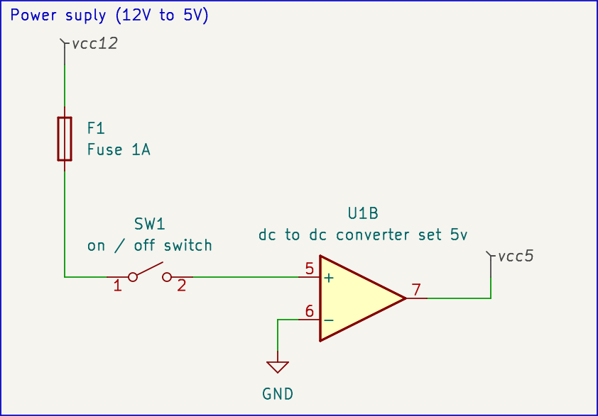

# power supply

## 110v / 220v system

To get 5v to supply **esp32** or **arduino** 

- wall plugs / usb chargers.
- power supply with output of 5v or more

## 12v / 24v system

- dc to dc step down converter
- dc to dc CC CV step down converter  (back )
- dc to dc CC CV step up converter ( bust )
- dc to dc CC CV back / bust converter

Models to look for when you buy
`XL4015` or `lm2596`

## schematics 

To build it from hardware point of view we need to connect some wires with components.

#### power supply 12v to 5v

